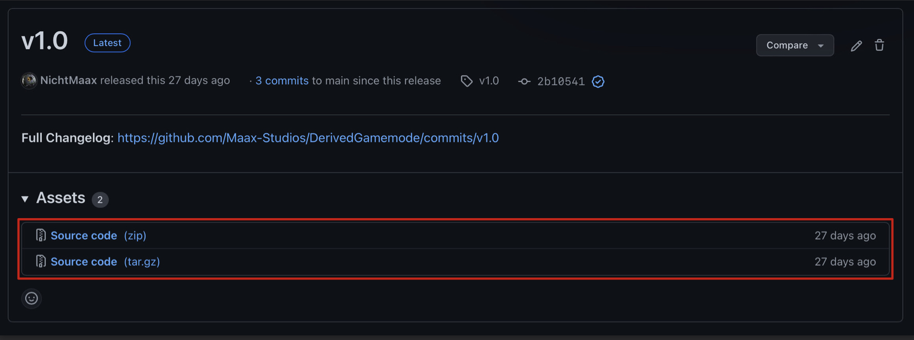
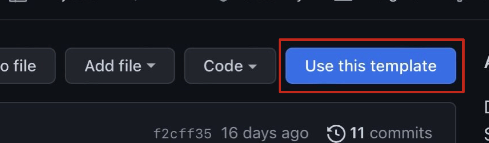
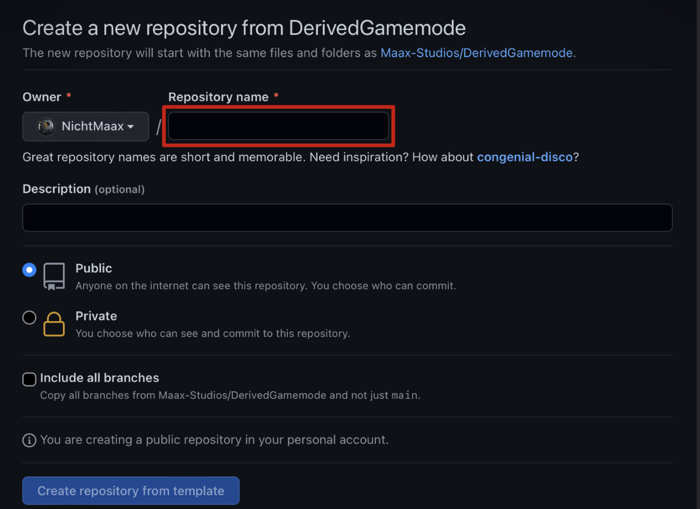

# Derived Gamemode

### <mark style="color:blue;">GitHub Repository</mark>



### <mark style="color:blue;">Setup</mark>



### <mark style="color:blue;">Open repository page</mark>



### <mark style="color:blue;">Download files</mark>

### <mark style="color:blue;">Modify files</mark>


WIP




### <mark style="color:blue;">Open repository page</mark>



### <mark style="color:blue;">Use template</mark>

### <mark style="color:blue;">Create repository</mark>



